# Employee Management System API

This project is an **Employee Management System** built using **Django** and **Django Rest Framework (DRF)**. It provides a backend API for managing employee records with functionalities such as **CRUD operations** (Create, Read, Update, Delete). For development purposes, the database used is **SQLite**, but it can be easily replaced with other databases in production.

## Features

- **CRUD Operations** for employee records
- Employee data includes details such as name, job title, department, and contact information.
- Ability to filter and search for employees based on various attributes.
- Use of Django Rest Framework to expose the API endpoints.
- Integrated authentication and permission management for securing access.
- Simple, intuitive endpoints for easy interaction.

## Requirements

- **Python 3.12.x
    asgiref==3.7.2
    backports.zoneinfo==0.2.1
    Django==3.2.25
    djangorestframework==3.15.1
    pytz==2024.2
    sqlparse==0.4.4
    typing-extensions==4.7.1
- **Django Rest Framework** 3.x
- **SQLite** (default database for development)

## Setup Instructions

Follow the steps below to set up the project on your local machine.

### 1. Clone the Repository

- Start by cloning the repository:
- git clone <repository_url>
- cd employee_management

### 2. Create a Virtual Environment
 - python3 -m venv venv
### 3. Install Dependencies
  - pip install -r requirements.txt
### 4. Apply Database Migrations
   - py manage.py makemigrations
   - python manage.py migrate
### 5. Run the Development Server
   - python manage.py runserver

## Screenshots
### GET Method (Get All data Of Employee)
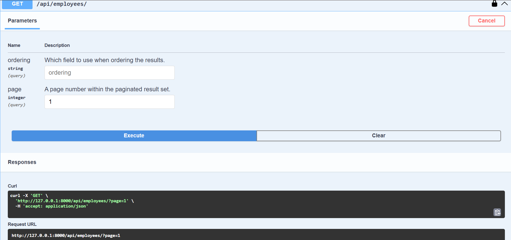
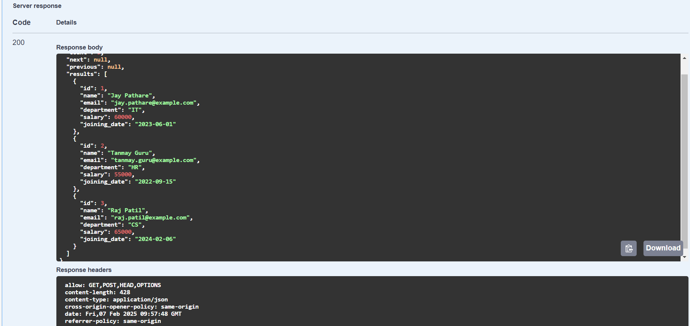
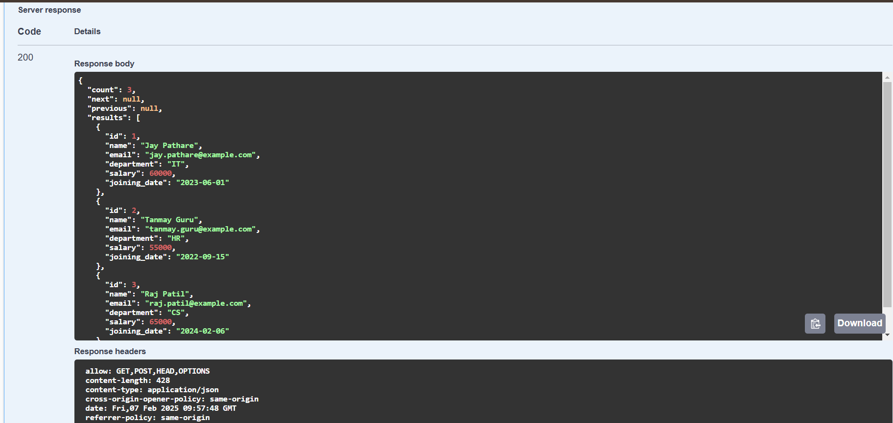
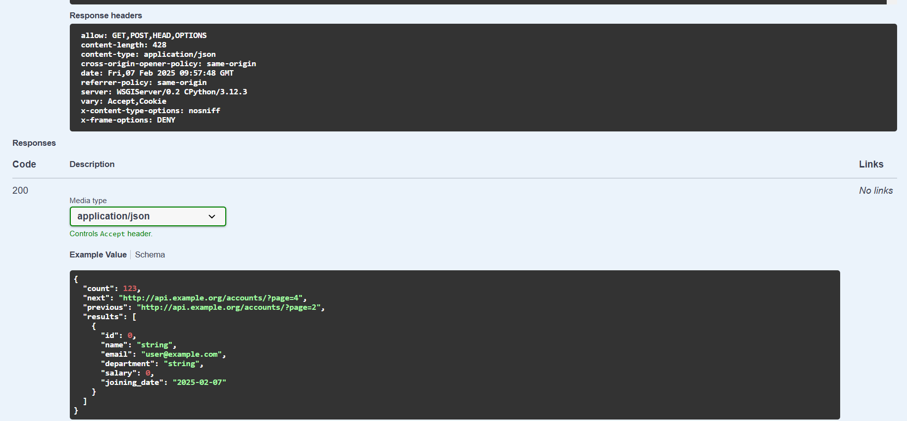
### POST Method ( Create Employee data)
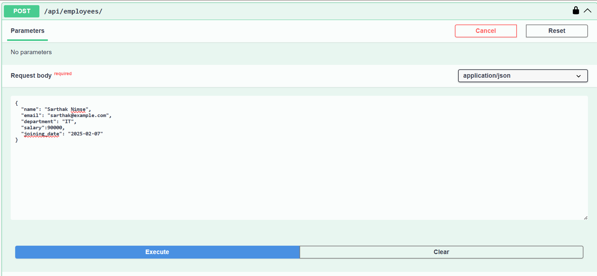
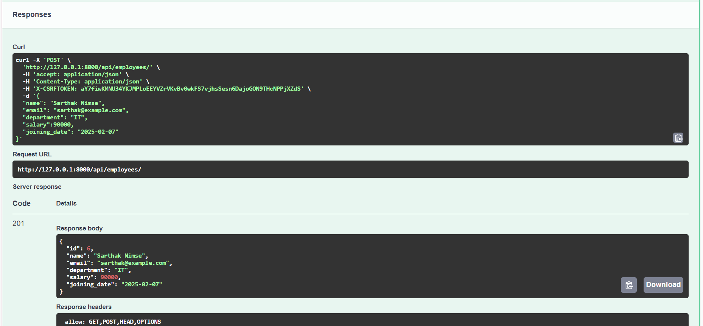
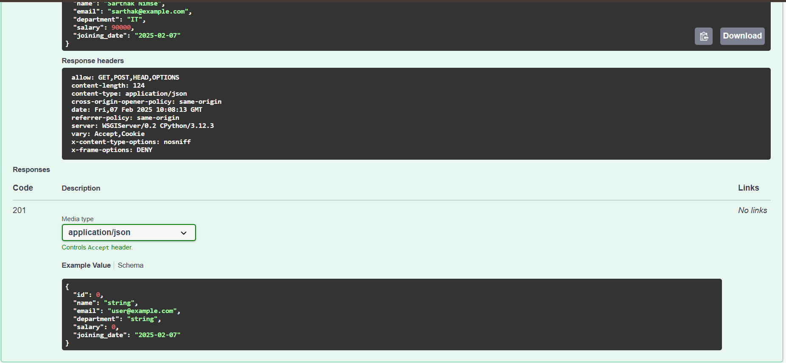
 ### GET Method ( Get one data of employee)
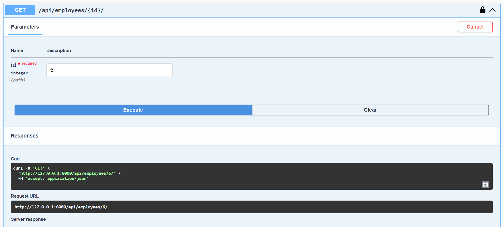
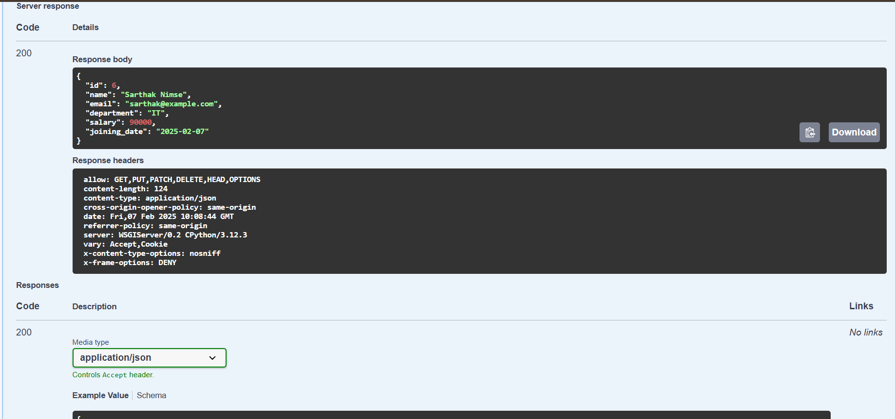
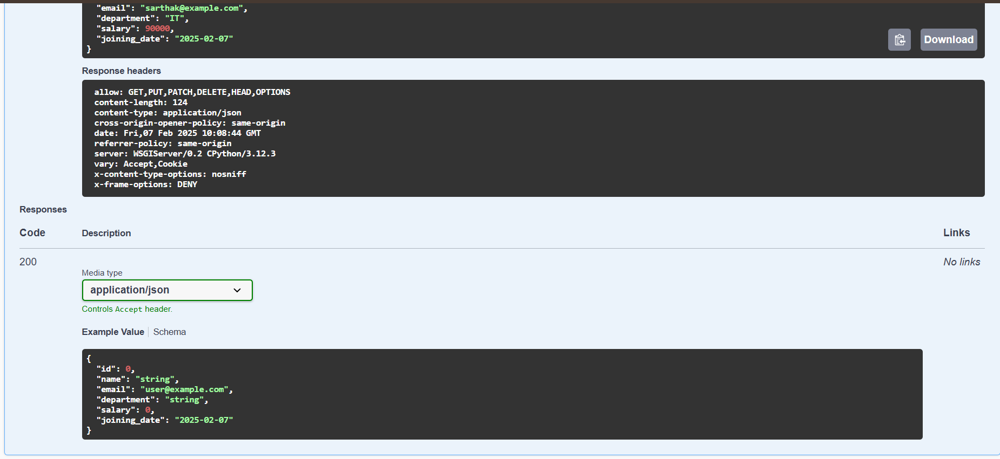
 ### PUT Method ( Update data of employee)
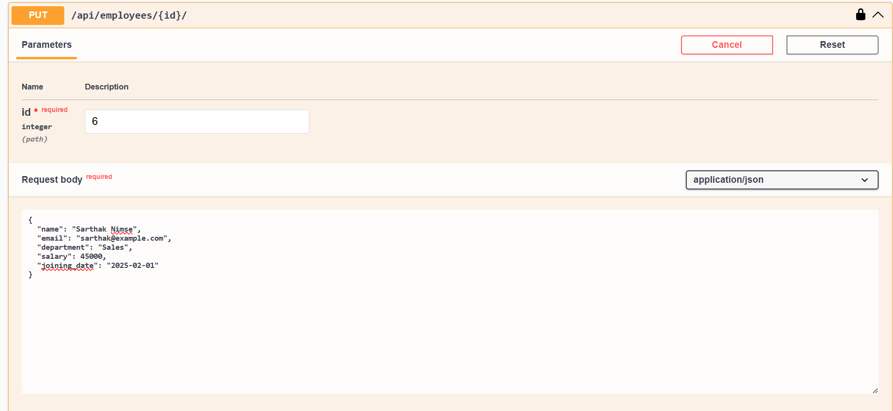
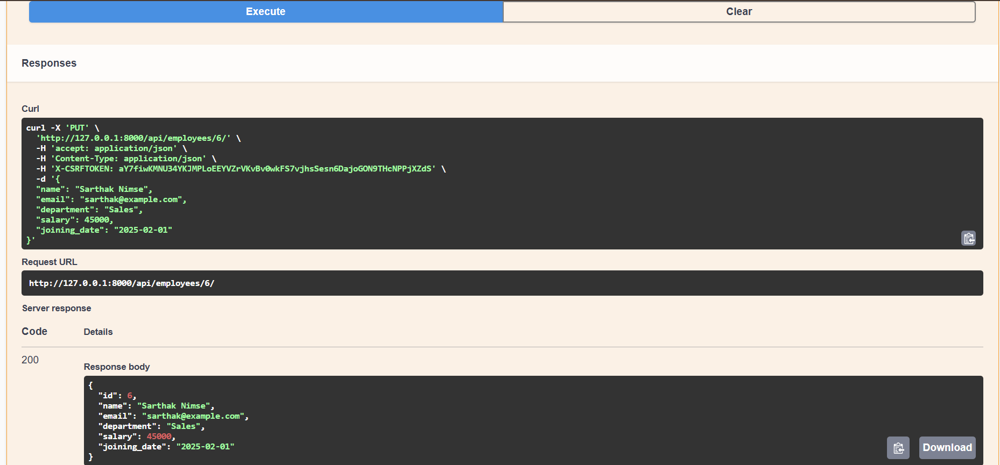
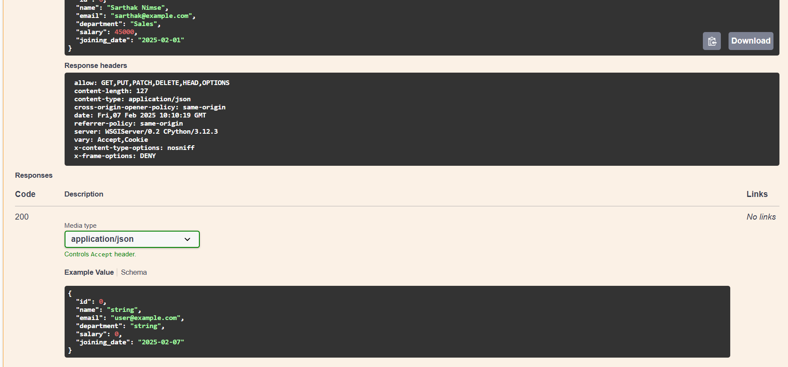
 ### PATCH Method ( Update single Field of Employee data)
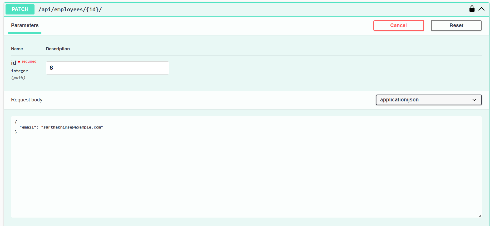
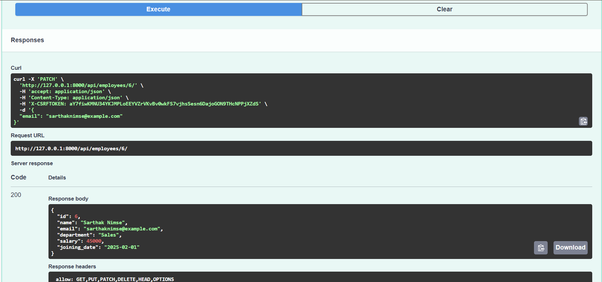
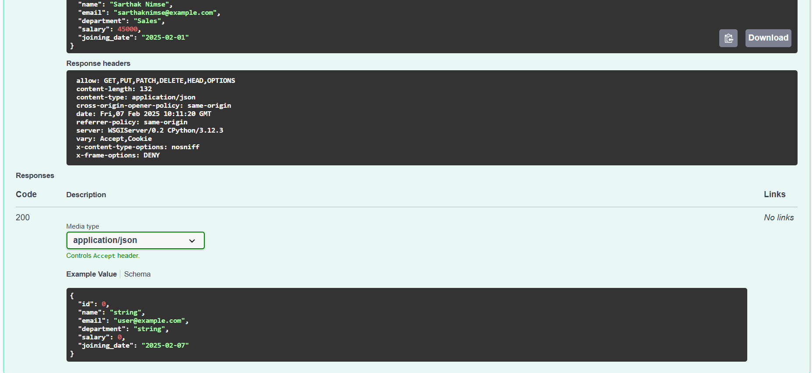
 ### DELETE Method ( Delete Employee Data )
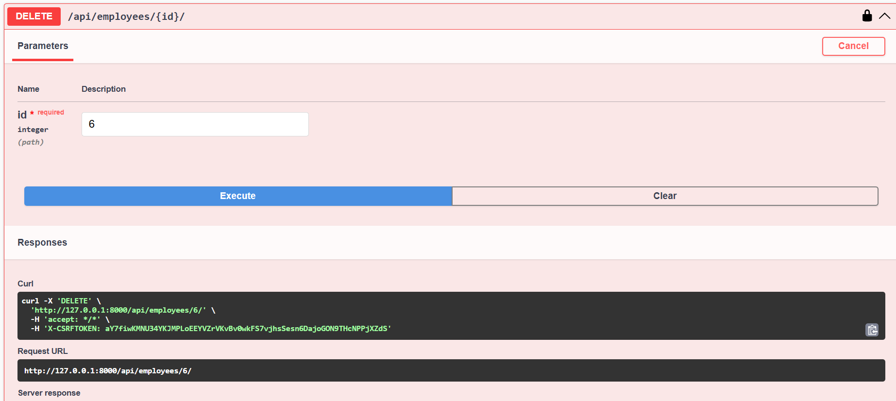
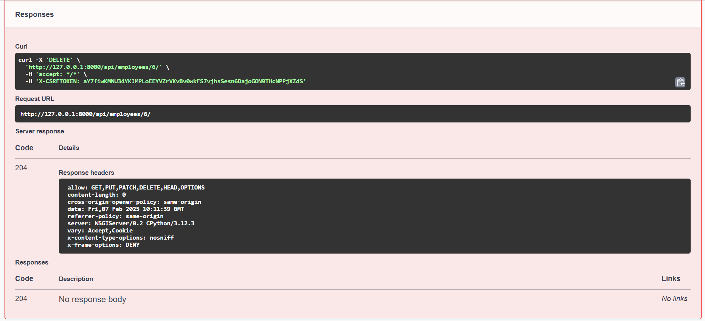
### Download Docs of Testing file
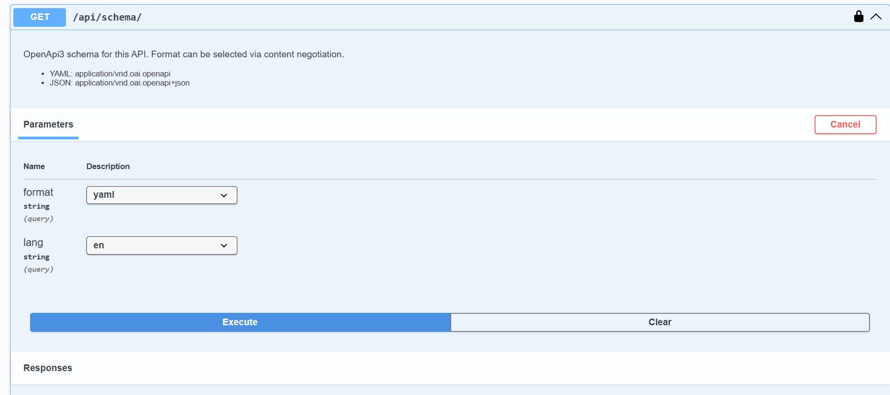
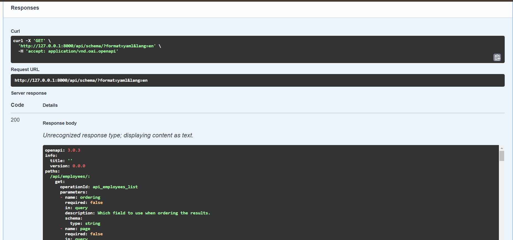
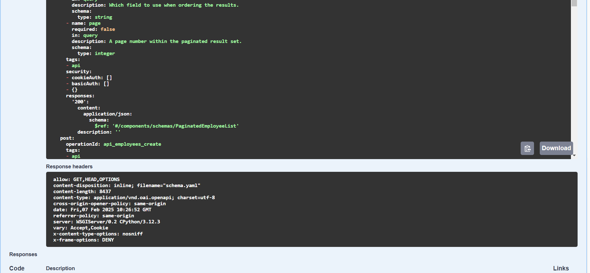
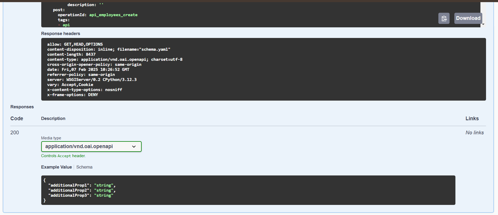
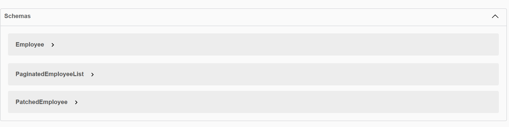
